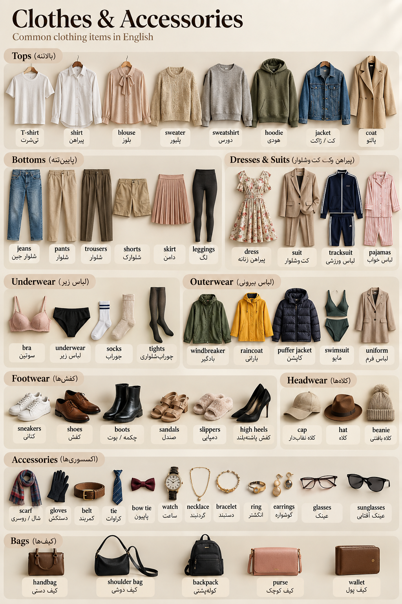

# pronunciation lesson 3 clothes
---
# اول بریم سراغه کلماتی که در بخش لباس ها (clothes)قرار میگیرن

<p align="center">
	
</p>

|English|تلفظ تقریبی|معنی فارسی|
|---|---|---|
|T-shirt|تی‌شِرت|تی‌شرت|
|shirt|شِرت|پیراهن|
|blouse|بلاوس|بلوز زنانه|
|sweater|سْوِتِر|پلیور / ژاکت بافتنی|
|sweatshirt|سْوِت‌شِرت|دورس / سویشرت|
|hoodie|هودی|هودی|
|jacket|جَکِت|کت / ژاکت|
|coat|کُوت|پالتو|
|suit|سوت|کت‌وشلوار|
|dress|دِرِس|پیراهن زنانه|
|skirt|اِسکِرت|دامن|
|jeans|جینز|شلوار جین|
|pants|پَنتس|شلوار|
|trousers|تراوزِرز|شلوار|
|shorts|شورتس|شلوارک|
|leggings|لِگینگز|لگ|
|tracksuit|تْرَک‌سوت|لباس ورزشی|
|pajamas|پِجامِز|لباس خواب|
|underwear|آندِروِر|لباس زیر|
|bra|برا|سوتین|
|socks|ساکس|جوراب|
|tights|تایتس|جوراب‌شلواری|
|shoes|شوز|کفش|
|sneakers|اِسنیکِرز|کفش کتانی|
|boots|بوتس|چکمه / بوت|
|sandals|سَندِلز|صندل|
|slippers|اِسلیپِرز|دمپایی|
|high heels|های هیلز|کفش پاشنه‌بلند|
|hat|هَت|کلاه|
|cap|کَپ|کلاه نقاب‌دار|
|scarf|اِسکارف|شال / روسری|
|gloves|گلاوز|دستکش|
|belt|بِلت|کمربند|
|tie|تای|کراوات|
|bow tie|بو تای|پاپیون|
|glasses|گْلَسِز|عینک|
|sunglasses|سان‌گْلَسِز|عینک آفتابی|
|watch|واچ|ساعت مچی|
|necklace|نِکلِس|گردنبند|
|bracelet|بْرِیس‌لِت|دستبند|
|ring|رینگ|انگشتر|
|earrings|ایرینگْز|گوشواره|
|bag|بَگ|کیف|
|handbag|هَندبَگ|کیف دستی|
|shoulder bag|شولدِر بَگ|کیف دوشی|
|backpack|بَک‌پَک|کوله‌پشتی|
|purse|پِرس|کیف کوچک / کیف پول زنانه|
|wallet|والِت|کیف پول|
|windbreaker|ویندبْرِیکِر|بادگیر|
|raincoat|رِین‌کُوت|بارانی|
|swimsuit|سْویم‌سوت|مایو|
|uniform|یونیفورم|لباس فرم|

نکته مهم: بعضی واژه‌ها معمولاً به شکل جمع استفاده می‌شن، مثل **jeans, pants, shorts, glasses, socks, shoes, sneakers, boots, sandals, gloves, earrings**. برای خیلی از لباس‌ها مثل **shirt, jacket, dress, skirt, coat** شکل مفرد کاملاً عادیه.

---

## اینم توجه کنید که s در کلمه ی اخر همیشه اس تلفظ نمیشه و سه مدل داره

|صدای آخر جمع|چه زمانی؟|مثال|
|---|---|---|
|**/s/**|بعد از صداهای بی‌صدا مثل `p, t, k, f`|pants, jackets, shirts|
|**/z/**|بعد از صداهای صدادار یا صداهای voiced|sneakers, earrings, ties|
|**/ɪz/**|بعد از صداهایی مثل `s, z, sh, ch, x, ge`|blouses, purses, dresses|

### 1) صدای /s/

مثلاً:

```
pants
jackets
shirts
hats
skirts
```

آخر این کلمات، `s` مثل **س** تلفظ میشه.

مثلاً:

**hat → hats**

آخر `hat` صدای `t` داریم، پس `s` به شکل `/s/` تلفظ میشه.

---

### 2) صدای /z/

مثلاً:

```
sneakers
earrings
ties
shoes
windbreakers
```

اینجا `s` آخر کلمه بیشتر شبیه **ز** تلفظ میشه.

مثلاً:

**shoe → shoes**

چون صدای قبل از `s` voiced هست، آخرش `/z/` می‌شنویم.

---

### 3) صدای /ɪz/

مثلاً:

```
blouses
purses
dresses
glasses
```

اینجا یک هجای اضافه هم ایجاد میشه.

مثلاً:

```
dress
→ dresses
```

تقریباً دو بخش شنیده میشه:

```
dress + iz
```

### تمرین پایین تصویر

جواب‌ها:

|Word|Pronunciation ending|
|---|---|
|dresses|**/ɪz/**|
|hats|**/s/**|
|shoes|**/z/**|
|windbreakers|**/z/**|
|skirts|**/s/**|
|glasses|**/ɪz/**|

برای جزوه‌ات می‌تونی این قانون کوتاه رو بنویسی:

```
Plural -s endings:

/s/  → after voiceless sounds
/z/  → after voiced sounds
/ɪz/ → after s, z, sh, ch, x, ge sounds
```

نکته مهم: ما به **صدای آخر کلمه** نگاه می‌کنیم، نه صرفاً آخرین حرف نوشته‌شده.