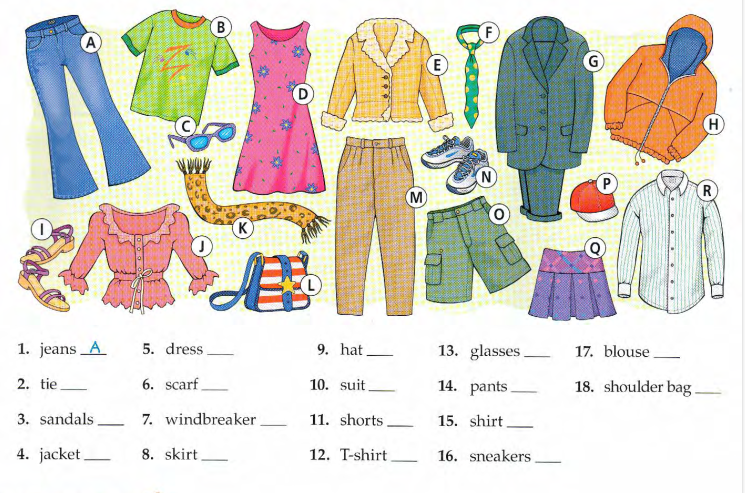

# lesson 3 clothes
---
# import word in lesson 3


<p align="center">
	
</p>

|Word|معنی|حرف تصویر|مفرد / جمع|
|---|---|---|---|
|**jeans**|شلوار جین|A|جمع|
|**tie**|کراوات|F|مفرد|
|**sandals**|صندل‌ها|I|جمع|
|**jacket**|کت / ژاکت|E|مفرد|
|**dress**|پیراهن زنانه|D|مفرد|
|**scarf**|شال / روسری|K|مفرد|
|**windbreaker**|بادگیر|H|مفرد|
|**skirt**|دامن|Q|مفرد|
|**hat**|کلاه|P|مفرد|
|**suit**|کت‌وشلوار|G|مفرد|
|**shorts**|شلوارک|O|جمع|
|**T-shirt**|تی‌شرت|B|مفرد|
|**glasses**|عینک|C|جمع|
|**pants**|شلوار|M|جمع|
|**shirt**|پیراهن مردانه|R|مفرد|
|**sneakers**|کتانی / کفش ورزشی|N|جمع|
|**blouse**|بلوز زنانه|J|مفرد|
|**shoulder bag**|کیف دوشی|L|مفرد|

### نکته مهم مفرد و جمع

این کلمات معمولاً به شکل جمع استفاده می‌شن:

```
jeans
pants
shorts
glasses
sandals
sneakers
```

پس می‌گیم:

```
These jeans are new.
این شلوار جین نو است.
```

نه:

```
This jeans is new. ❌
```

برای `pants / jeans / shorts` اگر بخوای یک عدد ازشون بگی، معمولاً می‌گی:

```
a pair of jeans
a pair of pants
a pair of shorts
```

یعنی:

```
یک شلوار جین
یک شلوار
یک شلوارک
```

ولی کلماتی مثل این‌ها مفردند:

```
a tie
a jacket
a dress
a scarf
a skirt
a hat
a suit
a T-shirt
a shirt
a blouse
a shoulder bag
```

و جمع‌شون با `s` ساخته می‌شه، مثل:

```
shirt → shirts
jacket → jackets
dress → dresses
hat → hats
```

---
### جملات مهم این درس برایه توصیف اشخاص چی بگیم نمونه ای از مثال هاشو میگم


- **A: She/He is wearing jeans.**  
    شلوار جین پوشیده.
    
- **B: She/He is wearing a T-shirt.**  
    تی‌شرت پوشیده.
    
- **C: She/He is wearing glasses.**  
    عینک زده.
    
- **D: She is wearing a dress.**  
    پیراهن زنانه پوشیده.
    
- **E: She/He is wearing a jacket.**  
    کت / ژاکت پوشیده.
    
- **F: He is wearing a tie.**  
    کراوات زده.
    
- **G: He is wearing a suit.**  
    کت‌وشلوار پوشیده.
    
- **H: She/He is wearing a windbreaker.**  
    بادگیر پوشیده.
    
- **I: She/He is wearing sandals.**  
    صندل پوشیده.
    
- **J: She is wearing a blouse.**  
    بلوز زنانه پوشیده.
    
- **K: She/He is wearing a scarf.**  
    شال / روسری پوشیده.
    
- **L: She/He is carrying a shoulder bag.**  
    کیف دوشی همراه دارد.
    
- **M: She/He is wearing pants.**  
    شلوار پوشیده.
    
- **N: She/He is wearing sneakers.**  
    کفش کتانی پوشیده.
    
- **O: She/He is wearing shorts.**  
    شلوارک پوشیده.
    
- **P: She/He is wearing a hat.**  
    کلاه گذاشته.
    
- **Q: She is wearing a skirt.**  
    دامن پوشیده.
    
- **R: He is wearing a shirt.**  
    پیراهن پوشیده.
    

نکته مهم: برای لباس معمولاً از **wearing** استفاده می‌کنیم، ولی برای کیف طبیعی‌تره بگیم **carrying a shoulder bag**.

---
### یه ساختار خوب برایه اینکه بگی فلان جا چی قراره بپوشی
 تو می‌تونی با این ساختار جواب بدی:

**What are you gonna wear to + place/event?**  
یعنی: «قراره برایِ ... چی بپوشی؟»

مثلاً:

**What are you gonna wear to the party?**  
قراره برای مهمونی چی بپوشی؟

**I’m gonna wear a black shirt and jeans.**  
قراره یه پیراهن مشکی و شلوار جین بپوشم.
