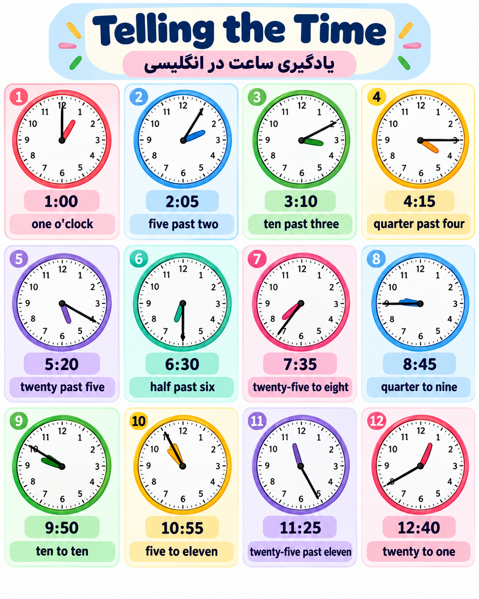

# lesson 4 routines
---

	

---
### جملات کاربردی این قسمت
 برای بخش **ساعت در انگلیسی** این جمله‌ها خیلی کاربردی‌اند:

- **What time is it?**  
    ساعت چنده؟
    
- **What’s the time?**  
    ساعت چنده؟
    
- **Do you know what time it is?**  
    می‌دونی ساعت چنده؟
    
- **Can you tell me the time?**  
    می‌تونی ساعت رو بهم بگی؟
    
- **It’s one o’clock.**  
    ساعت یک است.
    
- **It’s five past two.**  
    ساعت دو و پنج دقیقه است.
    
- **It’s ten past three.**  
    ساعت سه و ده دقیقه است.
    
- **It’s a quarter past four.**  
    ساعت چهار و ربع است.
    
- **It’s half past six.**  
    ساعت شش و نیم است.
    
- **It’s twenty-five to eight.**  
    بیست‌وپنج دقیقه به هشت است.
    
- **It’s a quarter to nine.**  
    یک ربع به نه است.
    
- **It’s ten to ten.**  
    ده دقیقه به ده است.
    
- **It’s almost five.**  
    تقریباً ساعت پنج است.
    
- **It’s about seven.**  
    حدود ساعت هفت است.
    
- **It’s exactly eight o’clock.**  
    دقیقاً ساعت هشت است.
    
- **It’s nearly midnight.**  
    نزدیک نیمه‌شب است.
    
- **It’s noon.**  
    ظهر است.
    
- **It’s midnight.**  
    نیمه‌شب است.
    
- **What time do you wake up?**  
    چه ساعتی بیدار می‌شوی؟
    
- **I wake up at seven.**  
    من ساعت هفت بیدار می‌شوم.
    
- **What time do you go to work?**  
    چه ساعتی سر کار می‌روی؟
    
- **I go to work at eight thirty.**  
    من ساعت هشت و نیم سر کار می‌روم.
    
- **What time does the class start?**  
    کلاس چه ساعتی شروع می‌شود؟
    
- **The class starts at nine.**  
    کلاس ساعت نه شروع می‌شود.
    
- **What time does the train leave?**  
    قطار چه ساعتی حرکت می‌کند؟
    
- **The train leaves at 6:15.**  
    قطار ساعت شش و ربع حرکت می‌کند.
    
- **What time does the store close?**  
    فروشگاه چه ساعتی بسته می‌شود؟
    
- **The store closes at ten.**  
    فروشگاه ساعت ده بسته می‌شود.
    
- **Are you free at five?**  
    ساعت پنج آزادی؟
    
- **Let’s meet at seven.**  
    ساعت هفت همدیگر را ببینیم.
    
- **I’ll call you at eight.**  
    ساعت هشت بهت زنگ می‌زنم.
    
- **Don’t be late.**  
    دیر نکن.
    
- **I’m running late.**  
    دارم دیر می‌کنم.
    
- **I’m on time.**  
    سر وقت هستم.
    
- **I’m early.**  
    زود رسیدم.
    
- **I’m late.**  
    دیر کردم.
    

یک جمع‌بندی خیلی حفظی هم اینه:

**at + time** → در ساعت  
**at 7 o’clock** → ساعت ۷  
**at noon** → ظهر  
**at midnight** → نیمه‌شب

همین‌ها تقریباً ستون فقرات مکالمه‌های مربوط به ساعت‌اند.
