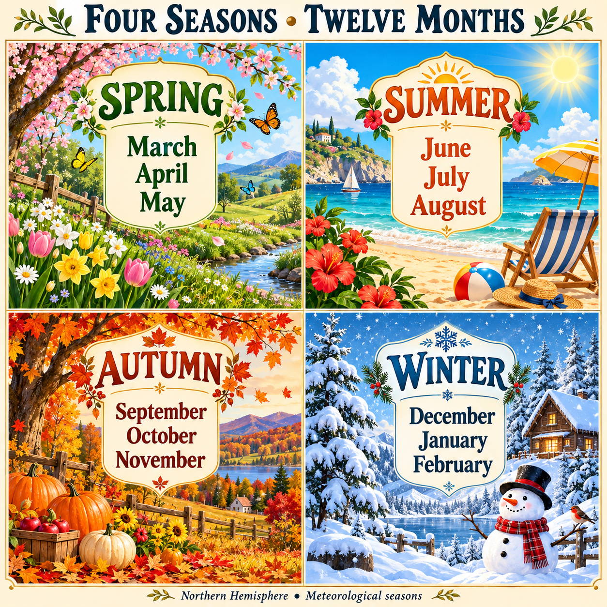

# unit 5 Dates
---
## 1-months with ordinal number 
January → first  
February → second  
March → third  
April → fourth  
May → fifth  
June → sixth  
July → seventh  
August → eighth  
September → ninth  
October → tenth  
November → eleventh  
December → twelfth

	

---
## 2-نوشتن تاریخ و خوندن تاریخ 
##### اول ساختارش به چه صورته؟
۱. **مدل آمریکایی**

**Month + Day + Year**

`3/2/2010 → March 2, 2010`

در گفتار: **March second, twenty ten**  
یعنی **۲ مارس ۲۰۱۰**. عدد وسطی، **روز** است.

۲. **مدل بریتانیایی**

**Day + Month + Year**

`3/2/2010 → 3 February 2010`

در گفتار: **the third of February, twenty ten**  
یعنی **۳ فوریهٔ ۲۰۱۰**. عدد اول، **روز** است.

در هر دو مدل، **روز را هنگام خواندن به شکل ترتیبی** می‌گوییم؛ مثل **second** و **third**.

---
## 3-سوال هایه مهم این قسمت

۱. **What’s the date today?**  
امروز چندم است؟

**It’s October 8, 2026.**  
امروز ۸ اکتبر ۲۰۲۶ است.

در گفتار: **October eighth, twenty twenty-six.**

---

۲. **When is your birthday?**  
تولدت چه روزی است؟

**My birthday is on February 24.**  
تولدم ۲۴ فوریه است.

در گفتار: **February twenty-fourth.**

---

۳. **When were you born?**  
چه زمانی به دنیا آمدی؟

**I was born on February 24, 2006.**  
من در ۲۴ فوریهٔ ۲۰۰۶ به دنیا آمدم.

---

۴. **What year were you born?**  
چه سالی به دنیا آمدی؟

**I was born in 2006.**  
من در سال ۲۰۰۶ به دنیا آمدم.

---

۵. **What month were you born in?**  
در چه ماهی به دنیا آمدی؟

**I was born in February.**  
من در فوریه به دنیا آمدم.

---

۶. **What’s your date of birth?**  
تاریخ تولدت چیست؟

**My date of birth is February 24, 2006.**  
تاریخ تولدم ۲۴ فوریهٔ ۲۰۰۶ است.

این سؤال بیشتر در موقعیت‌های رسمی و فرم‌ها استفاده می‌شود.

---

۷. **When is the exam?**  
امتحان چه تاریخی است؟

**The exam is on November 3.**  
امتحان سوم نوامبر است.

---

۸. **What day is it today?**  
امروز چه روزی از هفته است؟

**It’s Thursday.**  
امروز پنجشنبه است.

**فرق مهم:**

- **What’s the date?** → تاریخ: **October 8**
- **What day is it?** → روز هفته: **Thursday**

برای جواب‌ها هم یادت باشد:

**on + تاریخ مشخص** → **on February 24**  
**in + ماه یا سال** → **in February / in 2006**

---

# 4-**قانون حرف اضافه برای زمان اتفاق‌ها:**

|نوع زمان|حرف اضافه|مثال|
|---|---|---|
|تاریخ مشخص|**on**|I was born **on February 24, 2006**.|
|فقط ماه|**in**|I was born **in February**.|
|فقط سال|**in**|I was born **in 2006**.|
|ماه و سال|**in**|I was born **in February 2006**.|

برای اتفاق‌های دیگر هم همین قانون را استفاده می‌کنی:

> **I started university on September 21, 2024.**  
> من در ۲۱ سپتامبر ۲۰۲۴ دانشگاه را شروع کردم.

