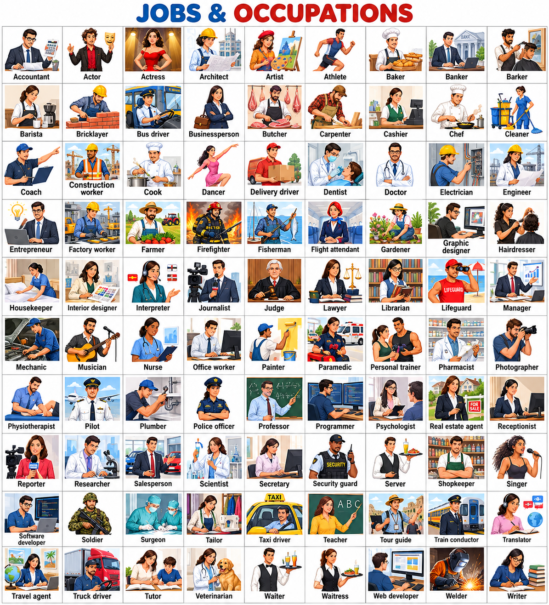

# lesson 6 Jobs
---
# important words

	

| کلمه                    | معنی فارسی                          | تلفظ فارسی            |
| ----------------------- | ----------------------------------- | --------------------- |
| **Accountant**          | حسابدار                             | اَکاونتِنت            |
| **Actor**               | بازیگر                              | اَکتِر                |
| **Actress**             | بازیگر زن                           | اَکْتْرِس             |
| **Architect**           | معمار                               | آرکیتِکت              |
| **Artist**              | هنرمند                              | آرتیست                |
| **Athlete**             | ورزشکار                             | اَث‌لیت               |
| **Baker**               | نانوا                               | بِیکِر                |
| **Banker**              | بانکدار                             | بَنکِر                |
| **Barber**              | آرایشگر مردانه                      | باربِر                |
| **Barista**             | باریستا؛ متخصص تهیه قهوه            | بَریستا               |
| **Bricklayer**          | بنا؛ آجرچین                         | بْریک‌لِیِر           |
| **Bus driver**          | راننده اتوبوس                       | باس دْرایوِر          |
| **Businessperson**      | تاجر؛ فرد شاغل در تجارت             | بِزنِس‌پِرسِن         |
| **Butcher**             | قصاب                                | بوچِر                 |
| **Carpenter**           | نجار                                | کارپِنتِر             |
| **Cashier**             | صندوق‌دار                           | کَشیر                 |
| **Chef**                | سرآشپز                              | شِف                   |
| **Cleaner**             | نظافتچی                             | کلینِر                |
| **Coach**               | مربی                                | کوچ                   |
| **Construction worker** | کارگر ساختمانی                      | کِن‌سْتراک‌شِن وِرکِر |
| **Cook**                | آشپز                                | کوک                   |
| **Delivery driver**     | راننده تحویل کالا؛ پیک              | دی‌لیوِری دْرایوِر    |
| **Dancer**              | رقصنده                              | دَنسِر                |
| **Dentist**             | دندان‌پزشک                          | دِنتیست               |
| **Doctor**              | پزشک                                | داکتِر                |
| **Electrician**         | برق‌کار                             | اِلِک‌تریشِن          |
| **Engineer**            | مهندس                               | اِنجِنیِر             |
| **Entrepreneur**        | کارآفرین                            | آنترِپرِنِر           |
| **Factory worker**      | کارگر کارخانه                       | فَکتِری وِرکِر        |
| **Farmer**              | کشاورز                              | فارمِر                |
| **Firefighter**         | آتش‌نشان                            | فایِرفایتِر           |
| **Fisherman**           | ماهیگیر                             | فیشِرمَن              |
| **Flight attendant**    | مهماندار هواپیما                    | فْلایت اَتِندِنت      |
| **Gardener**            | باغبان                              | گاردِنِر              |
| **Graphic designer**    | طراح گرافیک                         | گْرَفیک دی‌زاینِر     |
| **Hairdresser**         | آرایشگر مو                          | هِردْرِسِر            |
| **Housekeeper**         | مسئول نظافت و مرتب‌کردن خانه یا هتل | هاوس‌کیپِر            |
| **Interior designer**   | طراح داخلی                          | این‌تیریِر دی‌زاینِر  |
| **Interpreter**         | مترجم شفاهی                         | این‌تِرپْرِتِر        |
| **Journalist**          | روزنامه‌نگار                        | جِرنِلیست             |
| **Judge**               | قاضی                                | جاج                   |
| **Lawyer**              | وکیل                                | لایِر                 |
| **Librarian**           | کتابدار                             | لای‌بْرِری‌اَن        |
| **Lifeguard**           | نجات‌غریق                           | لایف‌گارد             |
| **Manager**             | مدیر                                | مَنِجِر               |
| **Mechanic**            | مکانیک                              | مِکَنیک               |
| **Musician**            | موسیقی‌دان؛ نوازنده                 | میوزیشِن              |
| **Nurse**               | پرستار                              | نِرس                  |
| **Office worker**       | کارمند اداری                        | آفیس وِرکِر           |
| **Painter**             | نقاش؛ نقاش ساختمان                  | پِینتِر               |
| **Paramedic**           | امدادگر فوریت‌های پزشکی             | پَرَمِدیک             |
| **Personal trainer**    | مربی خصوصی ورزشی                    | پِرسِنِل تْرِینِر     |
| **Pharmacist**          | داروساز                             | فارمِسیست             |
| **Photographer**        | عکاس                                | فِتاگْرِفِر           |
| **Physiotherapist**     | فیزیوتراپیست                        | فیزی‌او‌ثِرَپیست      |
| **Pilot**               | خلبان                               | پایلِت                |
| **Plumber**             | لوله‌کش                             | پْلامِر               |
| **Police officer**      | مأمور پلیس                          | پِلیس آفیسِر          |
| **Professor**           | استاد دانشگاه                       | پْرِفِسِر             |
| **Programmer**          | برنامه‌نویس                         | پْروگْرَمِر           |
| **Psychologist**        | روان‌شناس                           | سای‌کالِجیست          |
| **Real estate agent**   | مشاور املاک                         | ریِل اِستِیت اِیجِنت  |
| **Receptionist**        | مسئول پذیرش                         | ری‌سِپشِنیست          |
| **Reporter**            | خبرنگار                             | ری‌پورتِر             |
| **Researcher**          | پژوهشگر                             | ری‌سِرچِر             |
| **Salesperson**         | فروشنده                             | سِیلزپِرسِن           |
| **Scientist**           | دانشمند                             | سایِنتیست             |
| **Secretary**           | منشی                                | سِکرِتِری             |
| **Security guard**      | نگهبان                              | سِکیورِتی گارد        |
| **Server**              | پیشخدمت رستوران                     | سِروِر                |
| **Shopkeeper**          | مغازه‌دار                           | شاپ‌کیپِر             |
| **Singer**              | خواننده                             | سینگِر                |
| **Software developer**  | توسعه‌دهنده نرم‌افزار               | سافت‌وِر دی‌وِلِپِر   |
| **Soldier**             | سرباز                               | سولجِر                |
| **Surgeon**             | جراح                                | سِرجِن                |
| **Tailor**              | خیاط                                | تِیلِر                |
| **Taxi driver**         | راننده تاکسی                        | تَکسی دْرایوِر        |
| **Teacher**             | معلم                                | تیچِر                 |
| **Tour guide**          | راهنمای گردشگری                     | تور گاید              |
| **Train conductor**     | مأمور قطار؛ مسئول بلیت و مسافران    | ترِین کِن‌داکتِر      |
| **Translator**          | مترجم نوشتاری                       | تْرَنز‌لِیتِر         |
| **Travel agent**        | کارمند آژانس مسافرتی                | تْرَوِل اِیجِنت       |
| **Truck driver**        | راننده کامیون                       | تراک دْرایوِر         |
| **Tutor**               | معلم خصوصی                          | توتِر                 |
| **Veterinarian**        | دامپزشک                             | وِتِرِنِری‌اَن        |
| **Waiter**              | پیشخدمت مرد                         | وِیتِر                |
| **Waitress**            | پیشخدمت زن                          | وِیتْرِس              |
| **Web developer**       | توسعه‌دهنده وب                      | وِب دی‌وِلِپِر        |
| **Welder**              | جوشکار                              | وِلدِر                |
| **Writer**              | نویسنده                             | رایتِر                |

---

A: My job is so boring. I really don’t like being a **server**.  
شغلم خیلی کسل‌کننده است. واقعاً دوست ندارم پیشخدمت باشم.

B: Really? Maybe you should try something new.  
واقعاً؟ شاید بهتر باشد کار جدیدی را امتحان کنی.

A: I don’t know. I’ve always wanted to be an **architect**, but I’d have to go back to school.  
نمی‌دانم. همیشه می‌خواستم معمار بشوم، اما باید دوباره درس بخوانم.

B: So do it!  
خب، انجامش بده!

A: I can’t. I need to **earn money**, so I can’t quit my job.  
نمی‌توانم. باید پول دربیاورم، پس نمی‌توانم شغلم را ترک کنم.

B: Could you work part time in an **office** and also take **classes**?  
می‌توانی در یک دفتر پاره‌وقت کار کنی و هم‌زمان کلاس هم بروی؟

A: Well, maybe. I’ll think about it.  
خب، شاید. درباره‌اش فکر می‌کنم.

|جای خالی|معنی|تلفظ فارسی|
|---|---|---|
|**server**|پیشخدمت|سِروِر|
|**architect**|معمار|آرکیتِکت|
|**earn money**|پول درآوردن|اِرن مانی|
|**office**|دفتر کار|آفیس|
|**classes**|کلاس‌ها|کْلَسِز|

برای تکمیل دقیق مطابق کتاب، فایل صوتی همین تمرین را بفرست.
